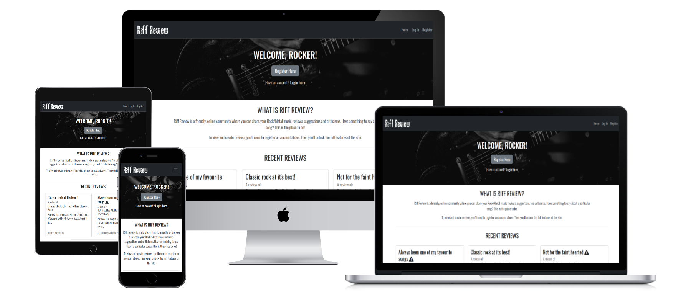

## **Riff Review**

[View the deployed project here](https://riff-review-076cf5fb62df.herokuapp.com/)

## **Site Overview**

Riff Review is an online application for rock and metal music lovers to read and post reviews of their favourite music, or new music they have found. Users are able to see limited features of the site until they register an account, but when registered they are able to create, edit and delete their own reviews quickly and easily.

## **Table of contents**

- [**Riff Review**](#riff-review)
- [**Site Overview**](#site-overview)
- [**Table of contents**](#table-of-contents)
- [**Planning stage**](#planning-stage)
  - [**Target Audiences**](#target-audiences)
  - [**User Stories**](#user-stories)
  - [**Site Aims**](#site-aims)
  - [**Wireframes**](#wireframes)
  - [**Color Scheme**](#color-scheme)
- [**Typography**](#typography)
- [**Features**](#features)
- [**Future Enhancements**](#future-enhancements)
- [**Testing Phase**](#testing-phase)
  - [**Responsiveness**](#responsiveness)
  - [**Functionality**](#functionality)
  - [**Validators**](#validators)
  - [**Lighthouse**](#lighthouse)
  - [**Testing user stories**](#testing-user-stories)
- [**Bugs**](#bugs)
- [**Deployment**](#deployment)
- [**Tech**](#tech)
- [**Credits**](#credits)
  - [**Honourable mentions**](#honourable-mentions)
  - [**Content**](#content)
  - [**Media**](#media)

## **Planning stage**

### **Target Audiences**

- Rock/metal music fans
- Users who attend rock/metal music festivals

### **User Stories**

- As a user, I want the site to be easy to use.
- As a user, I want to the site to be responsive.
- As a user, I want the ability to post, edit and delete reviews.
- As a user, I want the ability to read reviews posted by other users.

### **Site Aims**

- Offer a simple to use application where users can create, read, edit and delete music reviews.
- Offer the ability to register an account, allowing the user to see and manage their own reviews on a single page.
- To keep the user informed as they create, edit and delete reviews with confirmation of each step.

### **Wireframes**

Home Page (Desktop, Tablet & Mobile)

### **Color Scheme**

Other than the body which uses a clean white background, I decided to use a black/dark grey color scheme as those are the colours associated with the rock/metal community. Users from the rock/metal community should instantly feel at home with the colors chosen.

## **Typography**

I decided to import the Oswald font from Google Fonts as I felt it had a rock vibe to it without compromising on readability. It's stylish, clear to read and worked well with all of the applications features.

## **Features**

Home Page

## **Future Enhancements**

- An admin account could be added in future, with the relevant code to allow the admin to have full access to the application, including the ability to edit and delete all reviews, regardless if the review was created by the admin account itself.
- Users could be asked as part of the register process what their favourite music genre is, and a suggested reviews section could be introduced showing reviews of that genre which may be of more interest to them than any other.
- A voting/scoring system could be introduced so that users can 'like' a review, with the total likes showing on the review card. Reviews could then be sorted by popularity/likes.

## **Testing Phase**

### **Responsiveness**

Responsiveness was checked and worked as intended with the following browsers and screen sizes:

- Extra Large (27" Mac Desktop):

  - Chrome (120.0.6099.109 Official Build x86_64)
  - Safari (Version 17.2.1 19617.1.17.11.12)
  - Firefox (Version 121.0 64-bit)

- Large (15" MacBook Pro Laptop):

  - Chrome (120.0.6099.109 Official Build x86_64)
  - Firefox (121.0 64-bit)
  - Safari (Version 17.2 17617.1.17.11.11, 17617)

- Medium (10.9" iPad):

  - Chrome
  - Safari
  - Firefox

- Small (6" iPhone 13):

  - Chrome (120.0.6099.119)
  - Safari
  - Firefox (120.4 36613)

DevTools was also used to check the responsiveness at various screen sizes and devices from the list of devices available. All were fully responsive and caused no issues. 

### **Functionality**

### **Validators**

index.html HTML Validator

### **Lighthouse**

index.html Desktop Lighthouse results

### **Testing user stories**

**User story 1**: As a user, I want the site to be easy to use.

**Achieved?**: Yes. The application includes features and instructions which are clear to the user as they progress through the website.

**User story 2**: As a user, I want to the site to be responsive.

**Achieved?**: Yes. The application has been designed and tested to be responsive on all devices.

**User story 3**: As a user, I want the ability to post, edit and delete reviews.

**Achieved?**: Yes. Once an account is made, users are given the ability to create a new review via the 'New Review' page. They can also edit and delete their own reviews, either via the 'Reviews' page or their 'Profile' page.

**User story 4**: As a user, I want the ability to read reviews posted by other users.

**Achieved?**: Yes. Users are able to see three random reviews on the home page if they are not logged in. Once logged in, they can see all reviews on the 'Reviews' page.

## **Bugs**

I found the following bugs during the development process:

- Heading
  - Problem: 
  - Cause: 
  - Solution: 

---

## **Deployment**

---

## **Tech**

Languages:

- HTML
- CSS
- JavaScript
- Python

Tools:

- MongoDB
- Flask
- Bootstrap
- Fontawesome

## **Credits**

The following people, websites and learning materials aided me with the creation of this project.

### **Honourable mentions**

Special thanks to my mentor Richard Wells for his excellent advice and support throughout this project.

### **Content**

### **Media**

