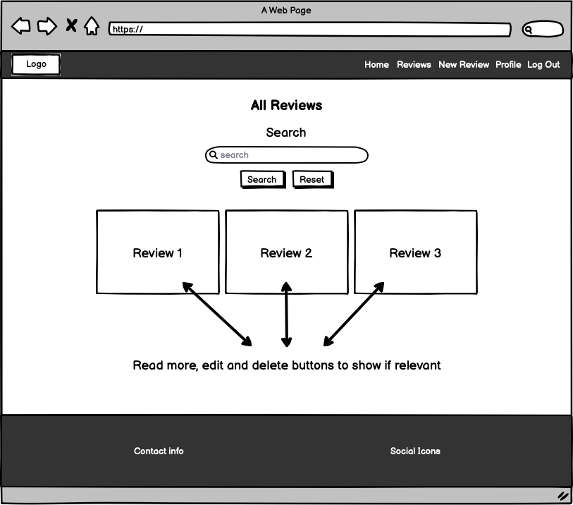
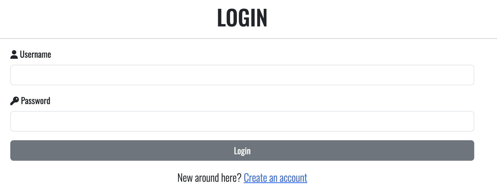
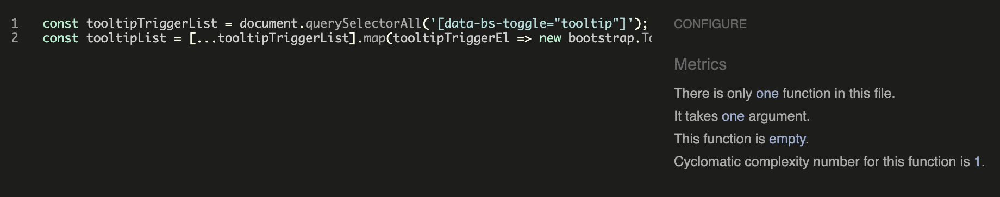
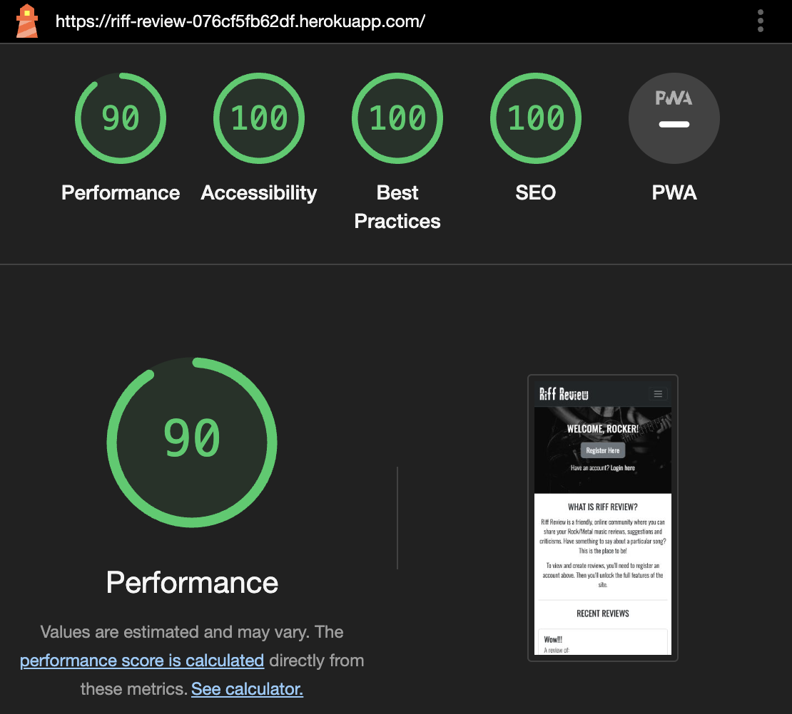
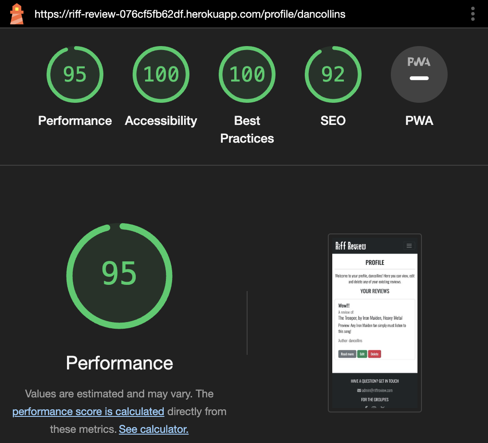
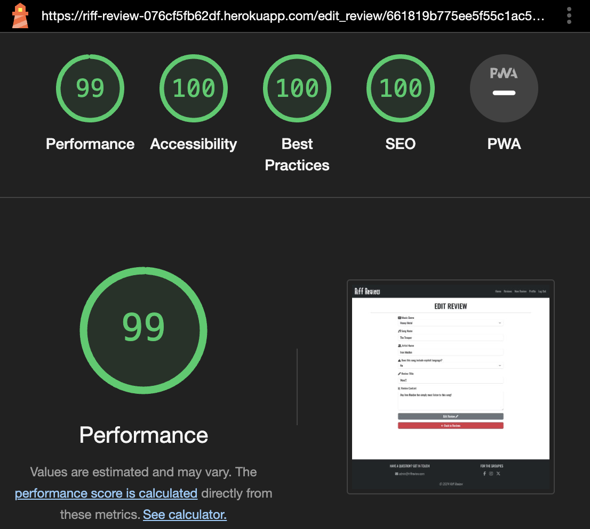
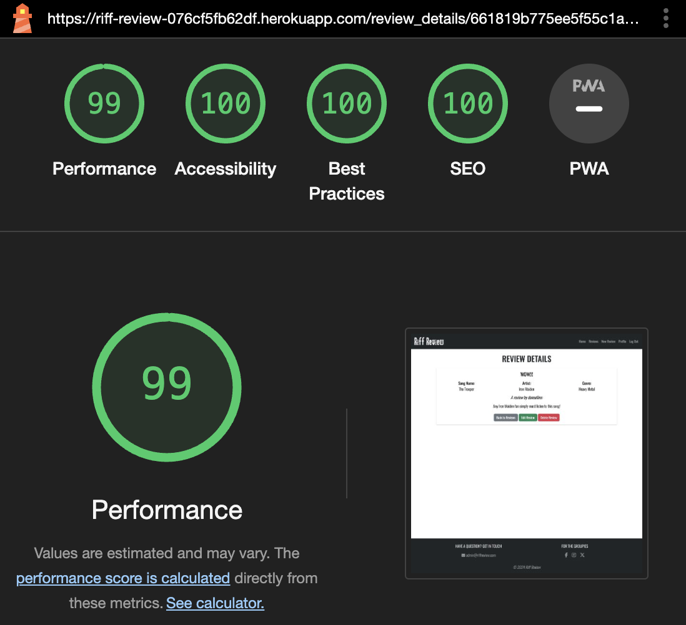

## **Riff Review**

[View the deployed project here](https://riff-review-076cf5fb62df.herokuapp.com/)

## **Site Overview**

Riff Review is an online application for rock and metal music lovers to read and post reviews of their favourite music, or new music they have found. Users are able to see limited features of the site until they register an account, but when registered they are able to create, edit and delete their own reviews quickly and easily.

## **Table of contents**

- [**Riff Review**](#riff-review)
- [**Site Overview**](#site-overview)
- [**Table of contents**](#table-of-contents)
- [**Planning stage**](#planning-stage)
  - [**Target Audiences**](#target-audiences)
  - [**User Stories**](#user-stories)
  - [**Site Aims**](#site-aims)
  - [**Wireframes**](#wireframes)
  - [**Color Scheme**](#color-scheme)
- [**Typography**](#typography)
- [**Features**](#features)
- [**Future Enhancements**](#future-enhancements)
- [**Testing Phase**](#testing-phase)
  - [**Responsiveness**](#responsiveness)
  - [**Functionality**](#functionality)
  - [**Validators**](#validators)
  - [**Lighthouse**](#lighthouse)
  - [**Testing user stories**](#testing-user-stories)
- [**Bugs**](#bugs)
- [**Deployment**](#deployment)
- [**Tech**](#tech)
- [**Credits**](#credits)
  - [**Honourable mentions**](#honourable-mentions)
  - [**Content**](#content)
  - [**Media**](#media)

## **Planning stage**

### **Target Audiences**

- Users with an interest or love of rock/metal music
- Users who attend rock/metal music festivals
- Rock/metal fans looking for new music to listen to
- Users thinking about getting into rock/metal music who don't know any of this kind of music

### **User Stories**

- As a user, I want the site to be easy to use.
- As a user, I want to the site to be responsive.
- As a user, I want the ability to read reviews posted by other users.
- As a user, I want the ability to post new reviews.
- As a user, I want the ability to read my own reviews.
- As a user, I want the ability to edit my own reviews.
- As a user, I want the ability to delete my own reviews.
- As a user, I want the ability to search for reviews by song or artist name.
- As a user, I want the ability to create an account.

### **Site Aims**

- Offer a simple to use application where users can create, read, edit and delete music reviews.
- Offer the ability to register an account, allowing the user to see and manage their own reviews on a single page.
- To keep the user informed as they create, edit and delete reviews with confirmation of each step.
- To allow the user to search for reviews quickly and easily.

### **Wireframes**

Wireframes are all based on a central responsive design using bootstrap, so only desktop wireframes have been provided. On mobile and tablet, all features will still be present, with a 'wrapping' effect suited to the screen size. On smaller devices, the navigation links will be stored in a collapsible 'burger' icon. Click on the relevant pages below to reveal the wireframes.

Home Page

 

 

Reviews Page

 

 

New Review Page

 

 

Profile Page

 

 

Edit Review Page

 

 

Review Details Page

 

 

Login Page

 

 

Register Page

 

### **Color Scheme**

Navbar and footer background: #212529 Dark Grey
 
Secondary buttons: #6c757d Light grey
 
Supporting text: #585c5f Grey
 
Footer text: #9a9d9e Grey

The [WCAG Color Contrast Checker](https://accessibleweb.com/color-contrast-checker/) was used to ensure the grey text used against the dark grey background was suitable, all results passed except the small text in the AAA test, however after a discussion with my mentor we agreed this was OK as the criteria for the AAA testing is incredibly high and almost never passes.

## **Typography**

I decided to import the Oswald font from Google Fonts as I felt it had a rock vibe to it without compromising on readability. It's stylish, clear to read and worked well with all of the applications features.

## **Features**

<strong>Features common to all pages</strong>

Navigation - The navbar appears on every page of the application. However, the links shown in the image only appear when the user is logged in. If the user is not logged in, they will see Home, Login and Register. The nav bar is fully responsive and collapses inside of a 'burger' icon on smaller devices. If the user wishes to logout, they are prompted with a confirmation modal to ensure they didn't press it by mistake.

Footer - The footer sticks to the bottom of the page, regardless of the pages height, so on shorter pages, there is no white gap at the bottom of the page. It includes a contact email address if the user wishes to get in touch with Riff Review, and also links to their social media accounts. The colour scheme is consistent with the navbar to provide an asthetic look.

Flash messages - Flash messages, such as 'You are logged out. Bye for now!' and various others are set to appear in the same place on every page (only when required/prompted via the app.py file). They appear above the first main heading of the page, below the nav bar, to keep consistency.

<strong>Home Page</strong>

Main guitar image - This is the first feature the user sees when they enter the website. It immediately fits the theme of the website, as it's someone playing a guitar. If the user isn't logged in, they see the register button and also a login prompt below if they do have an account. If the user is logged in already, the button changes to 'Browse Reviews' and the login prompt is removed.

Home welcome text - This is the next section the user sees on the home page. It's a basic explanation of the website with some instructions how to get the most out of it. It also nicely separates the large image above from the recent reviews cards below it.

Recent reviews - This feature displays three randomly selected reviews stored in the database. If the user is logged in, they can click the read more button to be taken to the specifc page of that review, however if the user is not logged in, the button does not appear, as this section is for registered users only. If there are no reviews found in the database, a message displays to tell the user no reviews have been found.

<strong>Reviews Page</strong>

Search box - This feature allows users to search for songs or artists, rather than scrolling through all of the reviews. The feature includes a reset button, so if the user has searched for something but wishes to reset the process, they are returned to the reviews page where they started.

All reviews - Below the search box, all reviews found in the database are neatly displayed. If no reviews can be found, a message is displayed to inform the user, with a prompt to be the first one to post a review. If a review belongs to a particular user, they will see the edit and delete buttons, otherwise they will only see read more, which directs them to the page for that spefic review.

If the review content is above 90 characters, the preview is capped at this amount with trailing dots, to show there is more to read by clicking on read more. If the content is below 90 characters, the content is shown in the preview as normal.

The ! tooltip is displayed if a user selects that the song contains explicit language when creating their review. When hovered over, it displays the relevant message to warn the user. If the user wishes to delete a review, they are prompted with a confirmation modal to ensure they didn't press it by mistake.

<strong>New Review Page</strong>

New Review form - This form is used to create a new review. The genre is a dropdown, which is populated by the genres pulled from the database. The song name, artist name and review title input fields include validation to allow a max length of 60 characters as this is long enough to describe the song, artist and provide a short & sharp title. Without it, the user could enter unlimated characters which could make the other pages messy where review previews are shown.

An info message was only incuded for the review title explaining this because people are more likely to use more than 60 characters for a title than the song and artist name. I also found that too many instruction messages was too much on one page. If the user chooses that a song does include explicit language, a tooltip / warning appears in the relevant place with the review to inform the other users reading it.

The review content is a large text box, where the user can type as much as they want as this is cut down on the review previews elsewhere on the website, however it's only shown at full length on the reviews specific page, which has plenty of room for an endless amount of content. I included a lightnight icon with the submit button to keep with the rock/metal theme.

<strong>Profile Page</strong>

Profile welcome message - This is a basic welcome message for the user when logged in and viewing their profile. The profile page is where the user lands when they register or login to their account. The message is populated with their username to give a more personal touch.

Profile reviews - This is where any reviews the particular user has created are displayed. They are prompted with the same read, edit and delete buttons for each review as they see on the main reviews page. If they haven't created any reviews yet, they are shown a message to confirm this along with a prompt to create their first review.

<strong>Edit Review Page</strong>

Edit review form - This form is a replica of the new review form, however it is populated with the existing review details which can be altered as needed. To save the changes, the user clicked edit review and the website and database are updated simultaneously. If they change their mind and wish to go back, there is a button for this also which takes them back to the main reviews page. The app.py file includes logic to stop users trying to hack into other users reviews that don't belong to them. If the user in session doesn't match the user who created the review, a flash message appears to tell them it is not their review and they are unable to edit it.

<strong>Review Details Page</strong>

Review details - This is the page where the specific review selected is displayed in full. It includes all of the relevant details filled in when creating a review. If the user chooses that the song includes explicit language a red warning alert appears at the bottom which can't be missed. If the review belongs to the user logged in, they are also shown the edit and delte buttons. Otherwise, the user only sees the back to reviews button, for when they are done reading.

<strong>Login Page</strong>

Login form - This form allows the user to login to their account. If they haven't created one, a prompt to register an account is included below. They must enter a username and password that matches that of a record in the database or they are shown a flash message to tell them the details are incorrect. Once the user is logged in, they are in session which prompts the changes and features to appear throughout the site mentioned above.

<strong>Register Page</strong>

Register form - This form allows the the user to register for an account if they don't already have one. If they already have an account, a prompt is displayed underneath the form where they can login. When registering for an account, the user must follow the validation requirements, clearly explained underneath each input. If they don't, they are told to follow the requirements when they try to register.

The form includes a confirm password input, and the website compares the two to ensure they are the same before the user is registered. If they are not the same, they are told this is the case and that they need to try again.

## **Future Enhancements**

- An admin account could be added in future, with the relevant code to allow the admin to have full access to the application, including the ability to edit and delete all reviews, regardless if the review was created by the admin account itself.
- Users could be asked as part of the register process what their favourite music genre is, and a suggested reviews section could be introduced showing reviews of that genre which may be of more interest to them than any other.
- A voting/scoring system could be introduced so that users can 'like' a review, with the total likes showing on the review card. Reviews could then be sorted by popularity/likes.
- By also obtaining the users email address, a forgot password function could be added allowing the user to reset their password if they forget their old one.

## **Testing Phase**

### **Responsiveness**

Responsiveness was checked and worked as intended with the following browsers and screen sizes:

- Extra Large (27" Mac Desktop):

  - Chrome (Version 123.0.6312.106 Official Build x86_64)
  - Safari (Version 17.4.1 19618.1.15.11.14)
  - Firefox (Version 123.0 64-bit)

- Large (15" MacBook Pro Laptop):

  - Chrome (Version 123.0.6312.107 Official Build x86_64)
  - Firefox (Version 124.0.1 64-bit)
  - Safari (Version 17.4.1 17618.1.15.111.8, 17618)

- Medium (10.9" iPad):

  - Chrome
  - Safari
  - Firefox

- Small (6" iPhone 13):

  - Chrome (Version 123.0.6312.52)
  - Safari
  - Firefox (Version 124.3 40336)

DevTools was also used to check the responsiveness at various screen sizes and devices from the list of devices available. All were fully responsive and caused no issues. 

### **Functionality**

Manual testing as a logged <strong>OUT</strong> user

Feature/Test                                            | Expected Outcome.                                                                                                                                                  | Result |
| ----------------------------------------------------- | ------------------------------------------------------------------------------------------------------------------------------------------------------------------ | ------ |
| Navbar layout                                         | Only able to see and click home, login and register                                                                                                                | Pass  |
| Logo in Navbar                                        | Redirect to Homepage                                                                                                                                               | Pass  |
| Nav links                                             | Redirect to the relevant pages                                                                                                                                     | Pass  |
| Home page, register here button                       | Redirect to the register page                                                                                                                                      | Pass  |
| Home page, recent reviews                             | To change each time on refresh, if more than 3 reviews are found                                                                                                   | Pass  |
| Footer, email link                                    | Start a new email to Riff Review                                                                                                                                   | Pass  |
| Footer, social media links                            | Redirect to relevant social media pages                                                                                                                            | Pass  |
| Login Page, login form                                | When user account exists in database and details entered match, logs user in and shows profile page                                                                | Pass  |
| Login Page, login form                                | When user details don't match any user accounts stored in the database, flash message should appear to explain                                                     | Pass  |
| Login Page, register link                             | Redirect to the register page                                                                                                                                      | Pass  |
| Register Page, register form                          | When user completes all fields following the instructions given and clicks register, automatically logged in shown profile page                                    | Pass  |
| Register Page, register form                          | If user doesn't complete all required fields, or follow instructions given, or if passwords don't match, flash message appears to explain and they must try again  | Pass  |
| Register Page, login link                             | Redirect to the login page                                                                                                                                         | Pass  |

Manual testing as a logged <strong>IN</strong> user

### **Validators**

<strong>HTML Validators</strong>

Home Page

 

 

Reviews Page

 

 

New Review Page

 

 

Profile Page

 

 

Edit Review Page

 

 

Review Details Page

 

 

Login Page

 

 

Register Page

 

 

404 Page

 

 

500 Page

 

 

<strong>CSS Validator</strong>

style.css result

<strong>JS Hint</strong>

script.js result

<strong>CI Python Linter</strong>

app.py result

### **Lighthouse**

Home Page Desktop

 

 

Home Page Mobile

 

 

Reviews Page Desktop

 

 

Reviews Page Mobile

 

 

New Review Page Desktop

 

 

New Review Page Mobile

 

 

Profile Page Desktop

 

 

Profile Page Mobile

 

 

Edit Review Page Desktop

 

 

Edit Review Page Mobile

 

 

Review Details Page Desktop

 

 

Review Details Page Mobile

 

 

Login Page Desktop

 

 

Login Page Mobile

 

 

Register Page Desktop

 

 

Register Page Mobile

 

### **Testing user stories**

**User story 1**: As a user, I want the site to be easy to use.

**Achieved?**: Yes. The application includes features and instructions which are clear to the user as they progress through the website.

**User story 2**: As a user, I want to the site to be responsive.

**Achieved?**: Yes. The application has been designed and tested to be responsive on all devices.

**User story 3**: As a user, I want the ability to read reviews posted by other users.

**Achieved?**: Yes. Users are able to see three random reviews on the home page if they are not logged in. Once logged in, they can see all reviews on the 'Reviews' page.

**User story 4**: As a user, I want the ability to post new reviews.

**Achieved?**: Yes. Users are able to create new reviews which are posted to the website once they create an account.

**User story 5**: As a user, I want the ability to read my own reviews.

**Achieved?**: Yes. Once the user makes an account, they are provided with a unique profile page which displays any reviews linked to their account. They can also read their own reviews on the main reviews page.

**User story 6**: As a user, I want the ability to edit my own reviews.

**Achieved?**: Yes. The user is able to edit their own reviews via the edit button provided with their review, which is shown on all pages where their reviews exist, except the home page.

**User story 7**: As a user, I want the ability to delete my own reviews.

**Achieved?**: Yes. The user is able to delete their own reviews via the delete button provided with their review, which is shown on all pages where their reviews exist, except the home page. They are prompted with a modal to ensure they definitely want to delete the review and didn't click delete by mistake.

**User story 8**: As a user, I want the ability to search for reviews by song or artist name.

**Achieved?**: Yes. The main reviews page includes a search box where they are told they can search for songs or artists. All results are shown quickly. From there, if their search returns any results, they can read the review further via the read more button.

**User story 9**: As a user, I want the ability to create an account.

**Achieved?**: Yes. When a user first enters the website, they can register for an account via the register button in the navigation or the register button shown on the guitar image, which is one of the first sections they see.

## **Bugs**

I found the following bugs during the development process:

- Unable to run project via IDE
  - Problem: MONGO URI is not found when trying to run the app from IDE
  - Cause: Typo error, IDE was trying to find eny.py instead of env.py
  - Solution: Typo was corrected and the MONGO URI was found, application was able to run from the IDE

- Review title input font size too big
  - Problem: When creating or editting a review, the text typed/showing in the input field was very big.
  - Cause: The ID linked to these fields was styled in the application CSS file with a larger font size, which is applicable on the review details page, but not in the forms on the new review or edit review pages.
  - Solution: The relevant ID name was changed so it was specific to the review details page only, and not the others.

- Console error on all pages when testing
  - Problem: Console log error as follows on all pages - Uncaught TypeError: Cannot read properties of null (reading 'addEventListener')
  - Cause: This was caused by the modal JS code in script.js added from Bootstrap
  - Solution: After removing said modal JS code, the error disappeared and all modals still worked as expected.

- Logged out users able to access restricted pages
  - Problem: When a user is logged out, they can still access pages restricted to logged in users only by replicating the URL in the URL bar. For example, logged out users can just add the extension /get_reviews onto the end of the home URL and access it without logging in.
  - Cause: No code is present to ensure that only logged in users can access these pages.
  - Solution: A new function was created for login_required which was applied to all the relevent pages which should be restricted to logged in users only. If a logged out user now tries to access one of these pages, they are redirected to the login page and told they must login to access them.

---

## **Deployment**

---

## **Tech**

Languages:

- HTML
- CSS
- JavaScript
- Python

Tools:

- MongoDB
- Flask
- Bootstrap
- Fontawesome
- Google Fonts

## **Credits**

The following people, websites and learning materials aided me with the creation of this project.

### **Honourable mentions**

Special thanks to my mentor Richard Wells for his excellent advice and support throughout this project.

### **Content**

The following link helped me to stick the footer to the bottom of the page at all times, even if the body content was short:

https://www.30secondsofcode.org/css/s/footer-at-the-bottom/#:~:text=You%20can%20use%20flexbox%20to,and%20flex%2Ddirection%3A%20column%20

The following link helped me to keep 'Author' at bottom of the relevant review card div they are nested in at all times:

https://stackoverflow.com/questions/46877347/how-to-align-div-to-bottom-inside-div-with-bootstrap

The following link helped me with the register Regex password validation as I wanted to ensure certain parameteres were met before the user could register:

https://stackoverflow.com/questions/19605150/regex-for-password-must-contain-at-least-eight-characters-at-least-one-number-a

### **Media**

https://www.pexels.com/photo/man-playing-guitar-811838/ - Main home guitar image