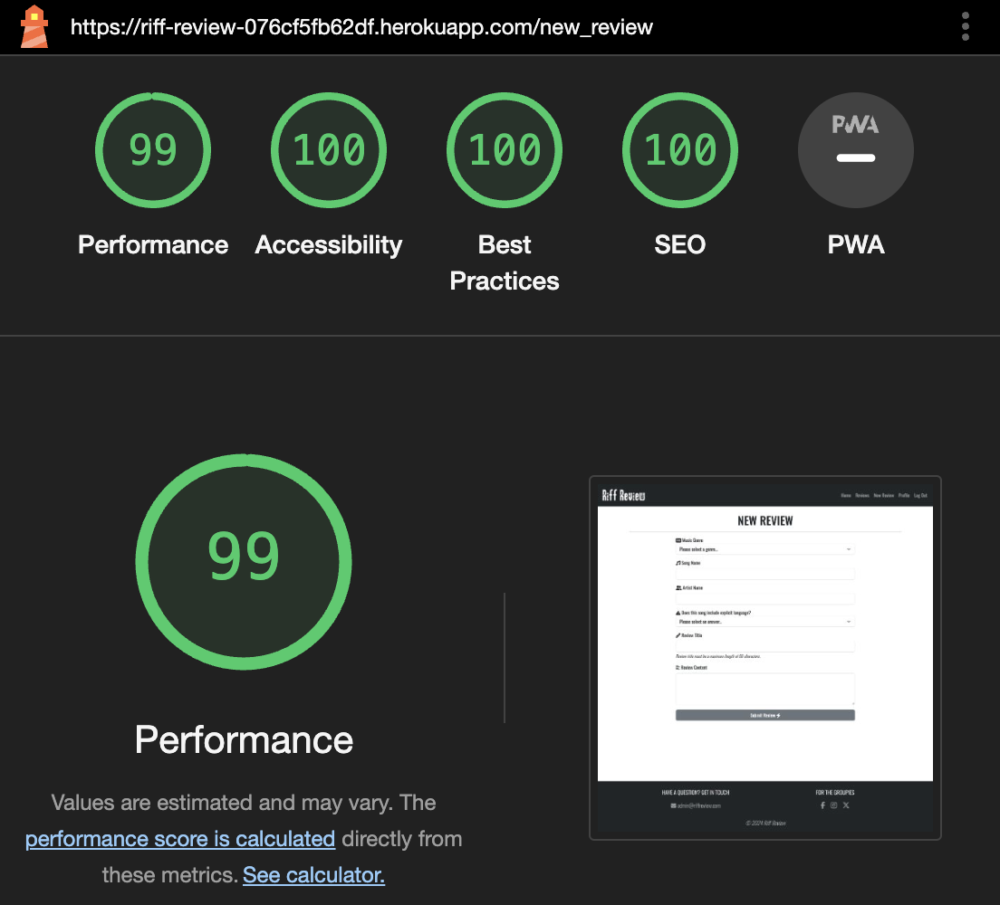
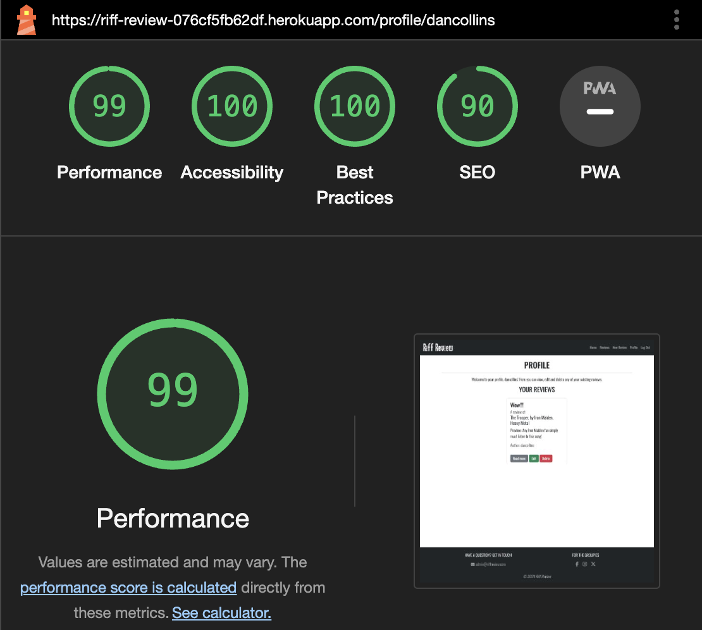
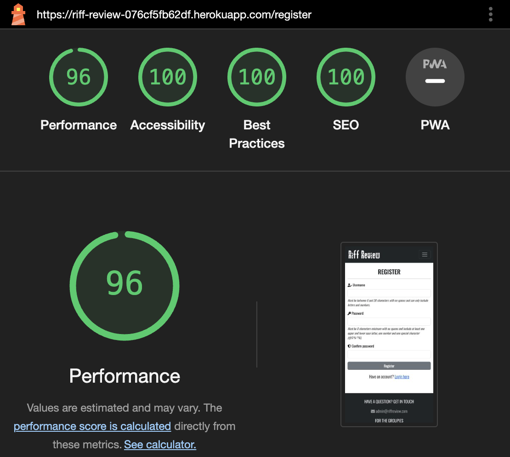

## **Riff Review**

[View the deployed project here](https://riff-review-076cf5fb62df.herokuapp.com/)

## **Site Overview**

Riff Review is an online application for rock and metal music lovers to read and post reviews of their favourite music, or new music they have found. Users are able to see limited features of the site until they register an account, but when registered they are able to create, edit and delete their own reviews quickly and easily.

## **Table of contents**

- [**Riff Review**](#riff-review)
- [**Site Overview**](#site-overview)
- [**Table of contents**](#table-of-contents)
- [**Planning stage**](#planning-stage)
  - [**Target Audiences**](#target-audiences)
  - [**User Stories**](#user-stories)
  - [**Site Aims**](#site-aims)
  - [**Wireframes**](#wireframes)
  - [**Color Scheme**](#color-scheme)
- [**Typography**](#typography)
- [**Features**](#features)
- [**Future Enhancements**](#future-enhancements)
- [**Testing Phase**](#testing-phase)
  - [**Responsiveness**](#responsiveness)
  - [**Functionality**](#functionality)
  - [**Validators**](#validators)
  - [**Lighthouse**](#lighthouse)
  - [**Testing user stories**](#testing-user-stories)
- [**Bugs**](#bugs)
- [**Deployment**](#deployment)
- [**Tech**](#tech)
- [**Credits**](#credits)
  - [**Honourable mentions**](#honourable-mentions)
  - [**Content**](#content)
  - [**Media**](#media)

## **Planning stage**

### **Target Audiences**

- Rock/metal music fans
- Users who attend rock/metal music festivals

### **User Stories**

- As a user, I want the site to be easy to use.
- As a user, I want to the site to be responsive.
- As a user, I want the ability to post, edit and delete reviews.
- As a user, I want the ability to read reviews posted by other users.

### **Site Aims**

- Offer a simple to use application where users can create, read, edit and delete music reviews.
- Offer the ability to register an account, allowing the user to see and manage their own reviews on a single page.
- To keep the user informed as they create, edit and delete reviews with confirmation of each step.

### **Wireframes**

Wireframes are all based on a central responsive design using bootstrap, so only desktop wireframes have been provided. On mobile and tablet, all features will still be present, with a 'wrapping' effect suited to the screen size. On smaller devices, the navigation links will be stored in a collapsible 'burger' icon. Click on the relevant pages below to reveal the wireframes.

Home Page

 

 

Reviews Page

 

 

New Review Page

 

 

Profile Page

 

 

Edit Review Page

 

 

Review Details Page

 

 

Login Page

 

 

Register Page

 

### **Color Scheme**

Other than the body which uses a clean white background, I decided to use a black/dark grey color scheme as those are the colours associated with the rock/metal community. Users from the rock/metal community should instantly feel at home with the colors chosen.

## **Typography**

I decided to import the Oswald font from Google Fonts as I felt it had a rock vibe to it without compromising on readability. It's stylish, clear to read and worked well with all of the applications features.

## **Features**

Home Page

## **Future Enhancements**

- An admin account could be added in future, with the relevant code to allow the admin to have full access to the application, including the ability to edit and delete all reviews, regardless if the review was created by the admin account itself.
- Users could be asked as part of the register process what their favourite music genre is, and a suggested reviews section could be introduced showing reviews of that genre which may be of more interest to them than any other.
- A voting/scoring system could be introduced so that users can 'like' a review, with the total likes showing on the review card. Reviews could then be sorted by popularity/likes.

## **Testing Phase**

### **Responsiveness**

Responsiveness was checked and worked as intended with the following browsers and screen sizes:

- Extra Large (27" Mac Desktop):

  - Chrome (Version 123.0.6312.106 Official Build x86_64)
  - Safari (Version 17.4.1 19618.1.15.11.14)
  - Firefox (Version 123.0 64-bit)

- Large (15" MacBook Pro Laptop):

  - Chrome (Version 123.0.6312.107 Official Build x86_64)
  - Firefox (Version 124.0.1 64-bit)
  - Safari (Version 17.4.1 17618.1.15.111.8, 17618)

- Medium (10.9" iPad):

  - Chrome
  - Safari
  - Firefox

- Small (6" iPhone 13):

  - Chrome (Version 123.0.6312.52)
  - Safari
  - Firefox (Version 124.3 40336)

DevTools was also used to check the responsiveness at various screen sizes and devices from the list of devices available. All were fully responsive and caused no issues. 

### **Functionality**

### **Validators**

<strong>HTML Validators</strong>

Home Page

 

 

Reviews Page

 

 

New Review Page

 

 

Profile Page

 

 

Edit Review Page

 

 

Review Details Page

 

 

Login Page

 

 

Register Page

 

 

404 Page

 

 

500 Page

 

 

<strong>CSS Validator</strong>

style.css result

<strong>JS Hint</strong>

script.js result. Warnings were ignored as they were simply suggesting arrow functions are only available in ES6. The undefined/unused variables were also ignored as this code is being used by bootstrap to enable tooltips on the front end.

<strong>CI Python Linter</strong>

app.py result

### **Lighthouse**

Home Page Desktop

 

 

Home Page Mobile

 

 

Reviews Page Desktop

 

 

Reviews Page Mobile

 

 

New Review Page Desktop

 

 

New Review Page Mobile

 

 

Profile Page Desktop

 

 

Profile Page Mobile

 

 

Edit Review Page Desktop

 

 

Edit Review Page Mobile

 

 

Review Details Page Desktop

 

 

Review Details Page Mobile

 

 

Login Page Desktop

 

 

Login Page Mobile

 

 

Register Page Desktop

 

 

Register Page Mobile

 

### **Testing user stories**

**User story 1**: As a user, I want the site to be easy to use.

**Achieved?**: Yes. The application includes features and instructions which are clear to the user as they progress through the website.

**User story 2**: As a user, I want to the site to be responsive.

**Achieved?**: Yes. The application has been designed and tested to be responsive on all devices.

**User story 3**: As a user, I want the ability to post, edit and delete reviews.

**Achieved?**: Yes. Once an account is made, users are given the ability to create a new review via the 'New Review' page. They can also edit and delete their own reviews, either via the 'Reviews' page or their 'Profile' page.

**User story 4**: As a user, I want the ability to read reviews posted by other users.

**Achieved?**: Yes. Users are able to see three random reviews on the home page if they are not logged in. Once logged in, they can see all reviews on the 'Reviews' page.

## **Bugs**

I found the following bugs during the development process:

- Unable to run project via IDE
  - Problem: MONGO URI is not found when trying to run the app from IDE
  - Cause: Typo error, IDE was trying to find eny.py instead of env.py
  - Solution: Typo was corrected and the MONGO URI was found, application was able to run from the IDE

- Review title input font size too big
  - Problem: When creating or editting a review, the text typed/showing in the input field was very big.
  - Cause: The ID linked to these fields was styled in the application CSS file with a larger font size, which is applicable on the review details page, but not in the forms on the new review or edit review pages.
  - Solution: The relevant ID name was changed so it was specific to the review details page only, and not the others.

---

## **Deployment**

---

## **Tech**

Languages:

- HTML
- CSS
- JavaScript
- Python

Tools:

- MongoDB
- Flask
- Bootstrap
- Fontawesome
- Google Fonts

## **Credits**

The following people, websites and learning materials aided me with the creation of this project.

### **Honourable mentions**

Special thanks to my mentor Richard Wells for his excellent advice and support throughout this project.

### **Content**

The following link helped me to stick the footer to the bottom of the page at all times, even if the body content was short:

https://www.30secondsofcode.org/css/s/footer-at-the-bottom/#:~:text=You%20can%20use%20flexbox%20to,and%20flex%2Ddirection%3A%20column%20

The following link helped me to keep 'Author' at bottom of the relevant review card div they are nested in at all times:

https://stackoverflow.com/questions/46877347/how-to-align-div-to-bottom-inside-div-with-bootstrap

The following link helped me with the register Regex password validation as I wanted to ensure certain parameteres were met before the user could register:

https://stackoverflow.com/questions/19605150/regex-for-password-must-contain-at-least-eight-characters-at-least-one-number-a

### **Media**

https://www.pexels.com/photo/man-playing-guitar-811838/ - Main home guitar image